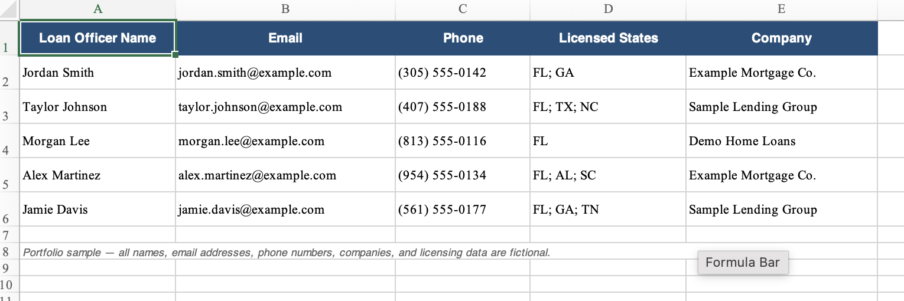

# Mortgage Loan Officer Directory Automation

Python-based web automation project developed to collect, structure, and export publicly available loan officer information from multiple mortgage company directories for business-development research.

## 📌 Project Overview

This project was originally developed to reduce the amount of repetitive manual research required to identify and organize publicly available loan officer information across mortgage company websites.

Using Python and multiple web automation and data-processing libraries, I developed workflows that navigated mortgage company directories, identified individual loan officer profiles, extracted relevant business information, and converted the results into structured datasets.

The automation collected information such as:

- Loan officer name
- Business email address
- Business phone number
- States in which the loan officer was licensed
- Mortgage company

The resulting datasets were organized and exported to **CSV and Excel** for business research.

---

## 🛠️ Technologies Used

- **Python**
- **Selenium**
- **BeautifulSoup**
- **Requests**
- **Pandas**
- **CSV**
- **Excel / OpenPyXL**

---

## 📊 Project Scale

The automation was adapted for approximately **3–5 mortgage company loan officer directories**.

Directory sizes varied depending on the company:

- Most directories contained **100+ loan officer records**
- One directory contained **300+ loan officer records**
- Each website used a different directory structure
- Results were exported into structured CSV and Excel datasets

Because the websites were not standardized, the automation required different approaches depending on how each directory loaded and displayed its information.

---

## ⚙️ Key Features

- Automated repetitive loan officer directory research
- Navigated web directories using Selenium
- Parsed HTML content using BeautifulSoup
- Used Requests when direct HTTP retrieval was appropriate
- Located and processed individual loan officer profiles
- Extracted structured business contact information
- Captured state licensing information
- Handled pagination and dynamically loaded content
- Organized extracted records using Pandas
- Reviewed and managed duplicate or missing records
- Exported results to CSV and Excel
- Adapted extraction logic for different website structures

---

## 🔄 General Workflow

```text
Mortgage Company Directory
            |
            v
    Directory Analysis
            |
            v
   Profile Discovery
            |
            v
 Selenium / Requests
            |
            v
    HTML Retrieval
            |
            v
   BeautifulSoup Parsing
            |
            v
   Data Extraction
            |
            v
   Pandas DataFrame
            |
            v
 Cleaning & Structuring
            |
            v
     CSV / Excel
```

---

## 📋 Data Structure

The original automation collected fields similar to:

| Field | Description |
|---|---|
| Name | Loan officer name |
| Email | Publicly listed business email |
| Phone | Publicly listed business phone number |
| Licensed States | States where the loan officer was listed as licensed |
| Company | Mortgage company associated with the directory |

---

## 🧪 Fictional Example

For privacy and portfolio purposes, this repository uses fictional demonstration data rather than information collected during the original project.

| Loan Officer Name | Email | Phone | Licensed States | Company |
|---|---|---|---|---|
| Jordan Smith | jordan.smith@example.com | (305) 555-0142 | FL, GA | Example Mortgage Co. |
| Taylor Johnson | taylor.johnson@example.com | (407) 555-0188 | FL, TX, NC | Sample Lending Group |
| Morgan Lee | morgan.lee@example.com | (813) 555-0116 | FL | Demo Home Loans |
| Alex Martinez | alex.martinez@example.com | (954) 555-0134 | FL, AL, SC | Example Mortgage Co. |
| Jamie Davis | jamie.davis@example.com | (561) 555-0177 | FL, GA, TN | Sample Lending Group |

> **Privacy Note:** All names, email addresses, phone numbers, companies, and licensing information shown above are fictional and were created solely for portfolio demonstration.

---

## 📸 Example Output

The following screenshot demonstrates how structured loan officer information can be presented after export to Excel.



> The screenshot contains fictional demonstration data and does not contain information from the original customer project.

---

## 🧩 Technical Challenges

### Dynamic Web Content

Some mortgage directories relied on JavaScript to load employee profiles or directory results.

In these situations, Selenium was used to interact with the website through a browser environment rather than relying exclusively on static HTTP requests.

### Pagination

Directory navigation varied between websites.

Examples included:

- Page-number navigation
- Next-page buttons
- Dynamically loaded results
- Interactive directory controls

The automation therefore had to account for different navigation methods.

### Inconsistent Website Structures

One of the largest challenges was that each mortgage company's directory was structured differently.

Differences included:

- HTML structure
- CSS selectors
- Profile URLs
- Pagination
- Page-loading behavior
- Location of contact information
- Presentation of licensing information

Extraction logic had to be analyzed and adapted for each directory.

### Browser Automation

Some directories behaved differently when accessed through automated browser sessions.

Troubleshooting involved:

- Waiting for elements to load
- Identifying appropriate selectors
- Scrolling through pages
- Navigating pagination
- Handling changing page structures
- Testing different extraction approaches

---

## 🧹 Data Processing

After extraction, collected records were organized using Pandas.

The data-processing workflow included:

1. Creating structured records
2. Converting records into a Pandas DataFrame
3. Reviewing missing values
4. Identifying duplicate records
5. Standardizing output fields
6. Preparing the final dataset
7. Exporting results to CSV and Excel

---

## 💡 Skills Demonstrated

This project demonstrates practical experience with:

### Programming & Automation

- Python
- Browser automation
- Web scraping
- Script troubleshooting
- Debugging

### Web Technologies

- HTML structure analysis
- CSS selectors
- Dynamic web content
- HTTP requests
- Browser-based navigation

### Data

- Data extraction
- Data cleaning
- Data transformation
- Pandas DataFrames
- CSV processing
- Excel exports

### Problem Solving

- Working across inconsistent website architectures
- Troubleshooting dynamic pages
- Adapting extraction strategies
- Automating repetitive manual processes
- Converting unstructured web information into structured datasets

---

## 📁 Repository Structure

```text
mortgage-directory-automation/
│
├── README.md
├── requirements.txt
├── sample-output.png
│
├── src/
│   └── directory_scraper.py
│
├── sample-data/
│   └── sample_output.csv
│
└── docs/
    └── methodology.md
```

---

## 🔒 Privacy & Data Handling

This repository is a **sanitized portfolio representation** of the original project.

The original automation worked with publicly available business-directory information. However, this public repository does **not** contain:

- Original customer datasets
- Customer information
- Production exports
- Customer-specific source code
- Credentials
- Private business information
- Original loan officer records

All names, email addresses, phone numbers, companies, and licensing information included in the public examples are fictional.

---

## 🚀 Future Improvements

Potential improvements to this project include:

- Creating reusable configurations for different directory structures
- Improved exception handling
- Automated logging
- Data validation
- Duplicate detection
- Retry logic
- Configurable export formats
- Command-line arguments
- More modular extraction functions
- Automated reporting of successful and failed records

---

## 🎯 What I Learned

This project strengthened my understanding of how Python can be used to automate real-world business processes.

The most important lesson was that web automation is rarely a one-size-fits-all process. Different websites required different approaches, and much of the development process involved inspecting website structures, troubleshooting unexpected behavior, modifying selectors, and testing alternative methods.

The project also strengthened my experience with transforming information collected from web sources into structured datasets that could be used for business purposes.

---

## 👩‍💻 Author

**Isabel Munguia**

Cybersecurity | Information Security | IT Risk & GRC

[LinkedIn](https://www.linkedin.com/in/isabel-munguia/)  
[GitHub](https://github.com/IsabelMunguia)

---

## ⚖️ Disclaimer

This repository is presented for educational and professional portfolio purposes.

Any web automation or data collection should be conducted in accordance with applicable laws, privacy requirements, website terms, and authorized business use.

The public version of this project contains only fictional demonstration data.
